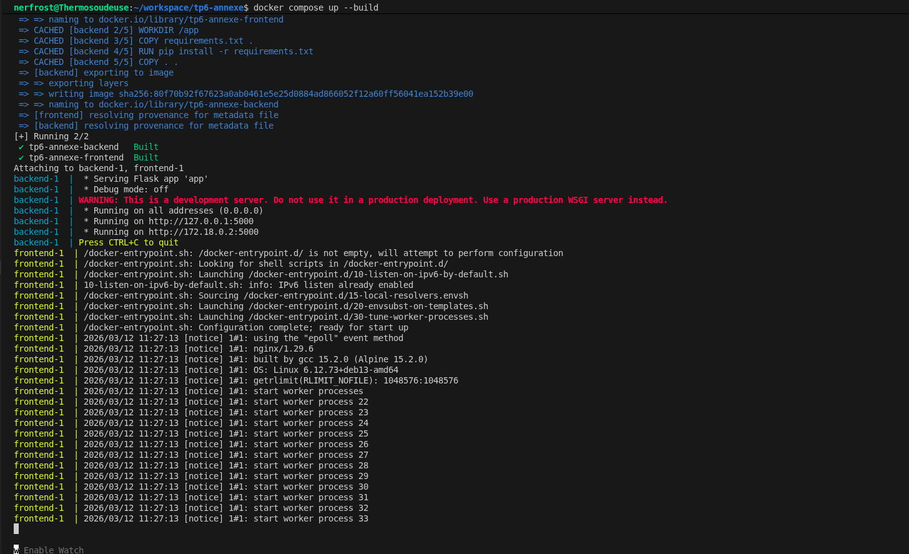
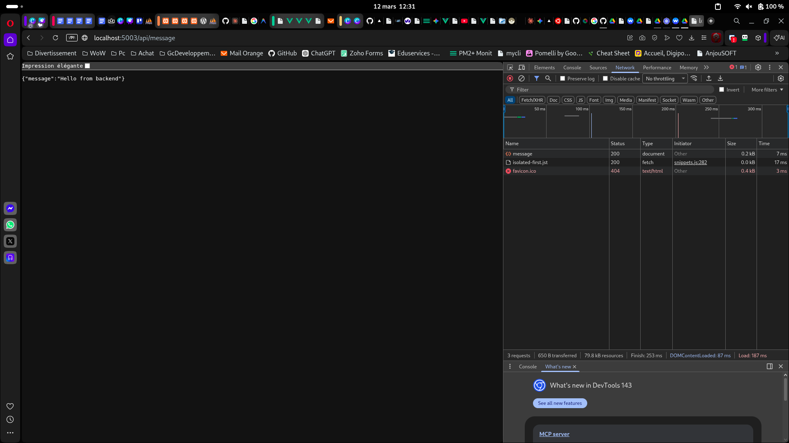
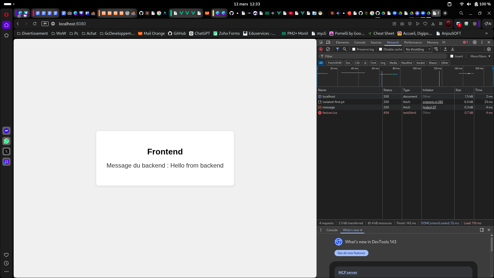

# TP6 Annexe - Frontend + Backend avec Docker Compose

## Projet

Une appli avec un frontend (Nginx) et un backend (Flask). Le frontend affiche une page HTML qui appelle l'API du backend et affiche le message retourné

## Architecture

backend/ API Flask avec une route GET /api/message :5003
frontend/ Page HTML servie par Nginx :8080
docker-compose.yml

Le frontend fait un fetch vers le backend pour récupérer le message et l'afficher sur la page.

## Lancer le projet

docker compose up --build

Backend : curl http://localhost:5003/api/message
Frontend : ouvrir http://localhost:8080 dans le navigateur
